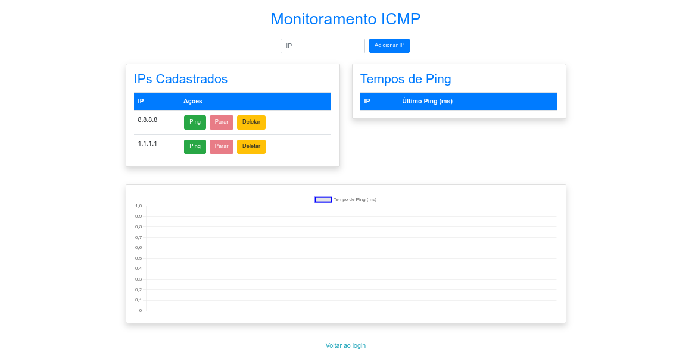

# WebApp Updetector

Este repositório contém um webapp para monitoramento de latência (ping) e gerenciamento de endereços IP. A aplicação possui uma interface gráfica com gráficos dinâmicos para exibir os tempos de ping em tempo real e permite adicionar, deletar e monitorar IPs via chamadas para endpoints RESTful.

## Funcionalidades

- Exibe gráficos dinâmicos do tempo de resposta (ping) usando Chart.js.
- Permite iniciar e parar o monitoramento do ping para IPs específicos.
- Gerencia uma lista de endereços IP, com funcionalidade para adicionar e remover.
- Atualiza automaticamente os últimos tempos de ping na interface.
- Comunicação com a API backend para operações de ping, listagem, adição e remoção de IPs.

## Requisitos

- Node.js (versão 14 ou superior)
- NPM ou Yarn
- Backend configurado com os seguintes endpoints:
  - `GET /dashboard/get-ips`
  - `POST /dashboard/add-ip`
  - `POST /dashboard/delete-ip`
  - `GET /dashboard/ping/:ip`
  - `GET /dashboard/last-ping-times`
- Um servidor web para servir os arquivos estáticos (HTML, CSS, JS)

## Dashboard do app

A imagem a seguir ilustra a área de trabalho do app:



## Instalação e Configuração

1. Faça o clone do repositório:
   ```bash
   git clone https://github.com/seu-usuario/nome-do-repositorio.git
   ```

2. Acesse o diretório do projeto:
   ```bash
   cd nome-do-repositorio
   ```

3. Instale as dependências:
   ```bash
   npm install
   ```

4. Configure as variáveis de ambiente (se necessário). Crie um arquivo `.env` na raiz do projeto e defina, por exemplo:
   ```bash
   NODE_ENV=development
   PORT=3000
   DATABASE_URL=<sua_url_de_conexao>
   SECRET=<sua_chave_secreta>
   ```

## Como Iniciar

### Modo de Desenvolvimento

1. Certifique-se de que o backend está devidamente configurado e rodando.
2. Inicie o servidor em modo desenvolvimento:
   ```bash
   npm run dev
   ```
3. Abra o navegador e acesse:
   ```
   http://localhost:3000
   ```
4. Faça login (caso o sistema exija autenticação) para gerar o token necessário e utilizar o webapp.

### Modo de Produção

1. Compile os arquivos (se aplicável) usando o build script definido no package.json:
   ```bash
   npm run build
   ```
2. Inicie o servidor em modo produção:
   ```bash
   npm start
   ```

## Tecnologias Utilizadas

- HTML5, CSS3 e JavaScript (ES6+)
- Chart.js para renderização dos gráficos
- Fetch API para comunicação com os endpoints do backend
- Node.js com Express (ou outra framework backend, conforme implementação)

## Estrutura do Código

- **public/**: Arquivos estáticos (HTML, CSS, JavaScript)
  - **js/dashboard.js**: Lógica de interface e comunicação com o backend para monitoramento dos pings.
- **routes/**: Endpoints do servidor (por exemplo, para o dashboard e APIs)
- **views/**: Templates do lado do servidor (se aplicável)
- **server.js**: Arquivo principal para iniciar o servidor
- **package.json**: Dependências e scripts do projeto

## Contribuição

1. Faça um fork do projeto.
2. Crie uma branch para sua feature (`git checkout -b feature/nova-funcionalidade`).
3. Faça commit das suas alterações (`git commit -am 'Adiciona nova funcionalidade'`).
4. Faça push para a branch (`git push origin feature/nova-funcionalidade`).
5. Abra um Pull Request.

## Licença

Distribuído sob a licença MIT. Veja [LICENSE](LICENSE) para mais informações.
```

```plaintext:folder-structure.png
project_root/
├── public/
│   ├── css/
│   │   └── styles.css
│   ├── js/
│   │   └── dashboard.js
│   └── index.html
├── routes/
│   └── dashboard.js
├── views/
│   └── dashboard.ejs
├── .env
├── app.js
├── package.json
└── README.md
