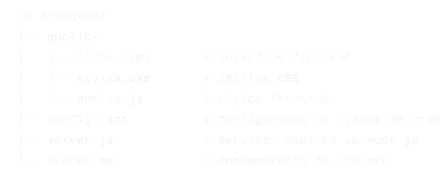

<h1 align="center"> Descrição </h1>

UP DETECTOR é uma aplicação desenvolvida para monitorar a disponibilidade de ativos de rede em tempo real utilizando ping ICMP. 
Ideal para equipes de TI e administradores de redes, a aplicação conta com uma interface frontend em HTML5 que permite visualizar 
o status dos ativos de forma intuitiva. O backend, implementado em Node.js, é responsável por realizar as verificações e atualizar o frontend.

<h2>Funcionalidades</h2>
    <ul>
        <li>
            Monitoramento ICMP (Ping): Verifica a disponibilidade dos dispositivos de rede por meio de pings ICMP.
        </li>
        <li>
            Notificações de Falha: Exibe alertas no frontend em caso de indisponibilidade dos ativos.
        </li>
        <li>
            Interface de Status em Tempo Real: Mostra o status de cada ativo em uma página web responsiva.
        </li>
        <li>
            Logs de Eventos: Registra históricos de disponibilidade para consulta.
        </li>
        <li>
            Configuração Fácil: Permite adicionar e remover ativos diretamente no arquivo de configuração.
        </li>
    </ul>

<h2>Requisitos</h2>
    <ul>
        <li>
            Node.js 14+
        </li>
        <li>
            Frontend: HTML5, CSS3, JavaScript (fetch API)
        </li>
        <li>
            Dependências Node.js: ping, express
        </li>
    </ul>
    
<h2>Instalação</h2>
    <ol>
        <li>
            Clone o repositório:
            <ul>
                <li>
                    bash
                </li>
                <li>
                    git clone https://github.com/Edvan-dev/DevWeb
                </li>
                <li>
                    cd network-asset-monitoring
                </li>
            </ul>
        </li>
        <li>
            Instale as dependências:
            <ul>
                <li>
                    bash
                </li>
                <li>
                     npm install
                </li>
            </ul>
        </li>
        <li>
            Inicie o servidor:
            <ul>
                <li>
                    bash
                </li>
                <li>
                     node server.js
                </li>
            </ul>
        </li>
    </ol>
    
<h2>Como Usar</h2>
<ul>
    <li>
        Acessando o Dashboard: Abra o navegador e vá para http://localhost:3000 para visualizar o dashboard em tempo real.
    </li>
     <li>
        Adicionando Ativos: No dashboard, você encontrará um campo para adicionar novos ativos de rede. Insira o IP ou o nome de host e clique em "Adicionar". O novo ativo será incluído na lista e monitorado imediatamente.
    </li>
     <li>
        Removendo Ativos: Para remover um ativo, clique no botão de exclusão ao lado do ativo desejado na lista. Isso interromperá o monitoramento do dispositivo em questão.
    • Visualizando o Status: A interface exibe
    </li>
     <li>
        o status de cada ativo em tempo real, indicando se está "Online" ou "Offline".
    </li>
</ul>
 
<h2>Executando o Software:</h2>
<ul>
    <li>
        Inicie o servidor Node.js e acesse a interface frontend para visualizar o status dos ativos monitorados.
    </li>
</ul>

<h2>Estrutura do Projeto</h2>

<dl>
    <dd>
        Up_detector/
    </dd>
    <dd>
        ├── public/
    </dd>
    <dd>
     │ 
    </dd>
</dl>

Up_detector/
├── public/
│   ├── index.html       # Interface frontend
│   ├── styles.css       # Estilos CSS
│   └── script.js        # Lógica frontend
├── config.json          # Configuração de ativos de rede
├── server.js            # Servidor backend em Node.js
└── README.md            # Documentação do projeto

<h2>Contribuição</h2>
Sinta-se à vontade para contribuir com este projeto! Basta seguir os passos abaixo:
<ol>
    <li>
        Fork este repositório.
    </li>
    <li>
        Crie uma nova branch: git checkout -b minha-feature.
    </li>
    <li>
        Faça commit das suas mudanças: git commit -m 'Minha nova feature'.
    </li>
    <li>
        Faça push para a branch: git push origin minha-feature.
    </li>
    <li>
        Abra um Pull Request.
    </li>
</ol>

<h3>Licença</h3>
Este projeto está licenciado sob a MIT License.

<h3>Contato</h3>
Para dúvidas ou sugestões, entre em contato com edvsplus@gmail.com

